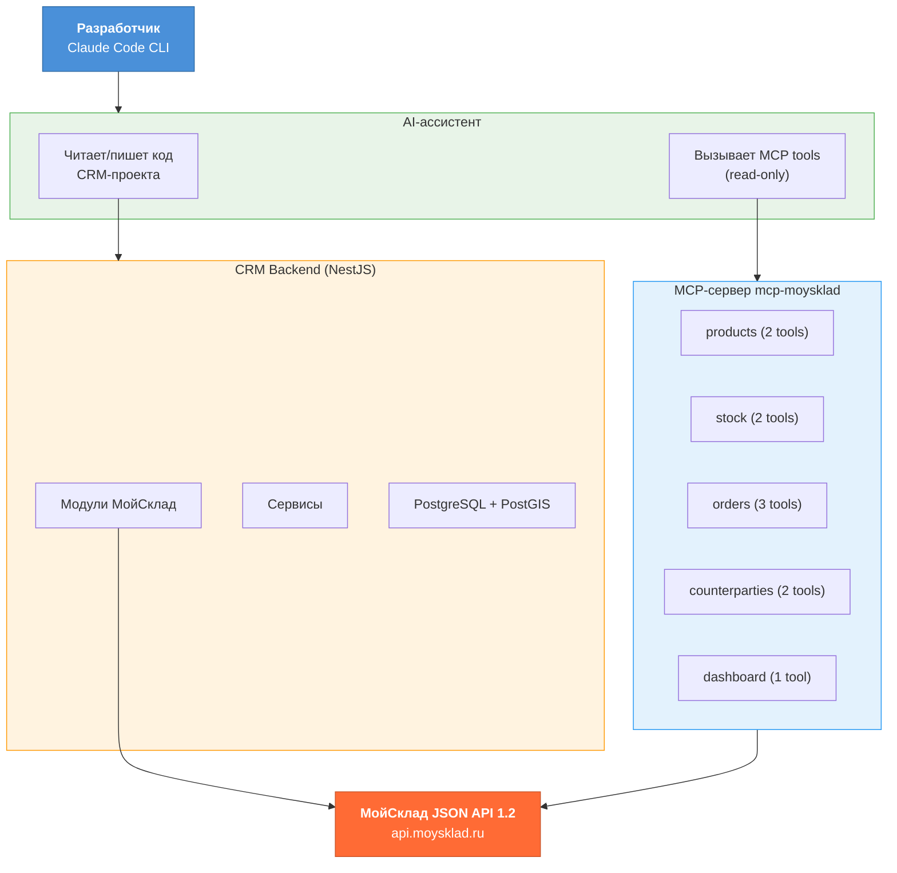
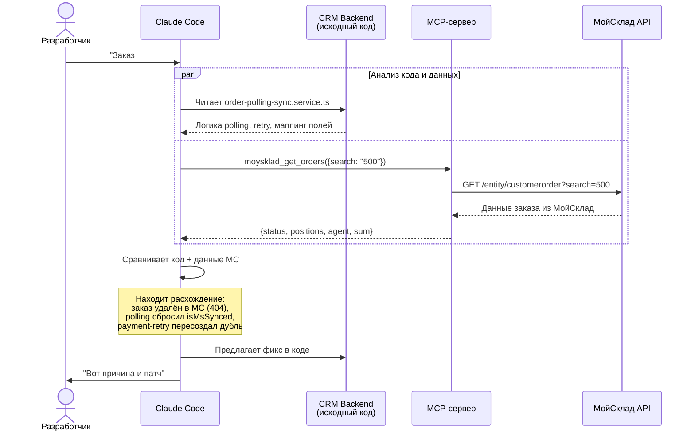
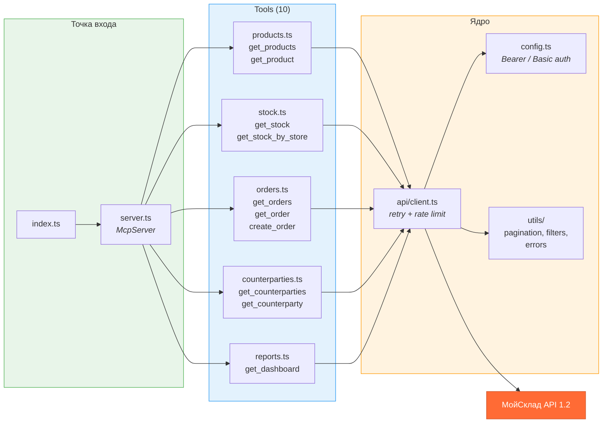

# MCP-сервер МойСклад как инструмент разработки

## Проблема: слепая отладка интеграции

Каждый, кто интегрировал свою систему с ERP (МойСклад, 1С, Bitrix24), знает эту боль:

1. Заказ не синхронизировался. Ты открываешь код, ставишь логи, пересобираешь, ждёшь.
2. Потом переключаешься в веб-интерфейс МойСклад, ищешь заказ, сверяешь поля.
3. Возвращаешься в код, правишь, повторяешь.

Два контекста. Постоянное переключение. Копирование UUID руками. А если баг воспроизводится раз в день по cron — удачи.

**А что если AI-ассистент, который помогает тебе писать код, мог бы одновременно заглядывать в боевой МойСклад?**

## Идея: MCP-сервер не как продукт, а как dev-инструмент

[MCP (Model Context Protocol)](https://spec.modelcontextprotocol.io/) — открытый протокол от Anthropic, который позволяет AI-ассистентам вызывать внешние инструменты. Обычно MCP-серверы делают как продукт для конечных пользователей: "подключи МойСклад к ChatGPT и спрашивай остатки голосом".

Мы пошли другим путём. Мы написали MCP-сервер для МойСклад и подключили его к **среде разработки** — к [Claude Code](https://claude.ai/code) (CLI-инструмент от Anthropic для разработки).

Теперь AI-ассистент, который помогает писать код CRM-системы, одновременно имеет доступ к API МойСклад. Он может:

- Читать код интеграции (NestJS-модули, сервисы, типы)
- Параллельно запрашивать реальные данные из МойСклад
- Сравнивать ожидаемое с фактическим
- Предлагать фикс с пониманием обоих контекстов

## Как это выглядит на практике

### Сценарий 1: Дебаг синхронизации заказов

```
Разработчик: "Заказ #500 не синхронизировался с МойСклад, разберись"

AI-ассистент:
  1. Читает order-polling-sync.service.ts — понимает логику синхронизации
  2. Вызывает moysklad_get_orders — ищет заказ в МойСклад по номеру
  3. Сравнивает статусы, суммы, позиции
  4. Находит: "В МойСклад заказ удалён (404), polling сбросил msOrderId,
     а payment-retry пересоздал дубль. Вот фикс — не сбрасывать isMsSynced
     при 404."
```

### Сценарий 2: Проверка остатков после изменения кода

```
Разработчик: "Добавил резервирование товаров при оплате, проверь"

AI-ассистент:
  1. Читает изменения в stock.service.ts
  2. Вызывает moysklad_get_stock — смотрит текущие остатки и резервы
  3. Вызывает moysklad_get_stock_by_store — проверяет по конкретному складу
  4. "Остаток фильтра Морион: 5 шт, резерв: 2 шт, доступно: 3 шт.
     Код корректно учитывает reserve. Но есть edge case — если quantity
     в заказе дробное (0.5), резерв округлится вниз. Вот тест."
```

### Сценарий 3: Разработка новой фичи

```
Разработчик: "Нужно добавить сопутствующие товары через Bundle МойСклад"

AI-ассистент:
  1. Вызывает moysklad_get_products — ищет бандлы в каталоге
  2. Смотрит структуру данных бандлов через API
  3. Читает существующий bundle.service.ts в CRM
  4. "В МойСклад есть 3 бандла в папке 'Сопутствующие товары'.
     Структура: components[] с productId и quantity.
     Вот план реализации эндпоинта GET /products/:id/related..."
```

## Архитектура

### Общая схема



### Сценарий дебага: синхронизация заказа



### Структура MCP-сервера



Ключевой момент: CRM и MCP-сервер — это **два независимых клиента** одного API. CRM работает в продакшне (создаёт заказы, синхронизирует данные). MCP-сервер работает в dev-среде (читает данные для отладки).

## Подключение

### 1. Установка MCP-сервера

```bash
git clone https://github.com/Pelmenya/mcp-moysklad.git
cd mcp-moysklad
npm install
echo "MOY_SKLAD_API_KEY=ваш_токен" > .env
npm run build
```

### 2. Подключение к проекту

Создайте `.mcp.json` в корне вашего проекта:

```json
{
    "mcpServers": {
        "moysklad": {
            "command": "node",
            "args": ["/путь/к/mcp-moysklad/dist/index.js"]
        }
    }
}
```

Токен хранится в `.env` MCP-сервера, а не в `.mcp.json` — секреты не попадут в git.

### 3. Добавьте `.mcp.json` в `.gitignore`

```
.mcp.json
```

Готово. При следующем запуске Claude Code в папке проекта MCP-сервер подключится автоматически.

## Доступные инструменты

| Tool | Описание | Тип |
|------|----------|-----|
| `moysklad_get_products` | Список товаров с поиском и фильтрацией | read |
| `moysklad_get_product` | Детали товара по ID | read |
| `moysklad_get_stock` | Остатки по всем складам | read |
| `moysklad_get_stock_by_store` | Остатки по конкретному складу | read |
| `moysklad_get_counterparties` | Список контрагентов | read |
| `moysklad_get_counterparty` | Детали контрагента по ID | read |
| `moysklad_get_orders` | Заказы покупателей с фильтрами | read |
| `moysklad_get_order` | Детали заказа с позициями | read |
| `moysklad_create_order` | Создание заказа покупателя | write |
| `moysklad_get_dashboard` | Сводка показателей | read |

9 из 10 инструментов — read-only. Единственный write — создание заказа — требует явного указания всех параметров.

## Почему это работает

**Два контекста в одном окне.** AI-ассистент одновременно видит код интеграции и реальные данные в МойСклад. Не нужно переключаться между IDE и веб-интерфейсом.

**Автоматическая сверка.** Вместо ручного сравнения полей заказа в БД и МойСклад, ассистент делает это за секунды.

**Контекст кода.** В отличие от простого API-клиента, ассистент понимает бизнес-логику — знает про polling, payment retry, webhook-обработчики, маппинг полей.

**Безопасность.** Read-only доступ через Bearer-токен. Секрет хранится в одном месте (`.env`), не дублируется.

## Что дальше

Сейчас MCP-сервер покрывает базовые операции чтения. В планах:

- **Документы**: отгрузки, приёмки, перемещения
- **Справочники**: склады, организации, валюты
- **Расширенные отчёты**: прибыльность, обороты
- **Batch-операции**: массовая проверка данных

## Ссылки

- **Репозиторий**: [github.com/Pelmenya/mcp-moysklad](https://github.com/Pelmenya/mcp-moysklad)
- **MCP Protocol**: [spec.modelcontextprotocol.io](https://spec.modelcontextprotocol.io/)
- **Claude Code**: [claude.ai/code](https://claude.ai/code)
- **API МойСклад**: [dev.moysklad.ru](https://dev.moysklad.ru/doc/api/remap/1.2/)

---

*Автор: [Pelmenya](https://github.com/Pelmenya)*
